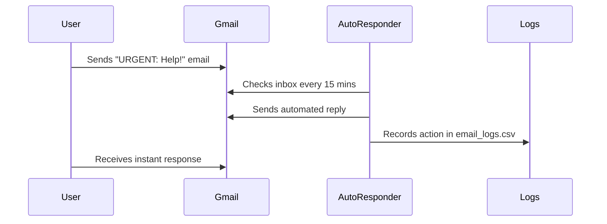

# 📧 Gmail Auto-Responder

[](https://www.python.org/)
[](https://github.com/psf/black)

An intelligent email auto-responder powered by Gmail API that:
- ✨ Automatically replies to emails based on customizable rules
- 📊 Maintains detailed logs of all actions
- 🛡️ Handles errors gracefully with user-friendly guidance
- 🎛️ Supports CLI configuration for flexible deployments

## 🚀 Features

| Feature                | Description                                                                 |
|------------------------|-----------------------------------------------------------------------------|
| **Smart Filtering**    | Reply based on keywords, senders, or subjects in emails                     |
| **Custom Rules**       | JSON-configurable response templates and conditions                         |
| **Detailed Logging**   | CSV logs with timestamps, actions taken, and rule matches                   |
| **Error Resilience**   | Clear troubleshooting guidance for common issues                            |
| **CLI Control**        | Configure via command line with custom paths and verbose debugging          |

## ⚙️ Setup

### 1. Prerequisites
```bash
# Clone the repository
git clone https://github.com/lana-mustafic/email-auto-responder.git
cd email-auto-responder

# Create virtual environment
python -m venv venv
source venv/bin/activate  # Linux/Mac
venv\Scripts\activate     # Windows
```

### 2. Install Dependencies
```bash
pip install -r requirements.txt
```

### 3. Google Cloud Configuration
1. Enable Gmail API at [Google Cloud Console](https://console.cloud.google.com/)
2. Download `credentials.json` to project root
3. Run authentication:
```bash
python auth.py
```

## 🖥️ Usage

### Basic Usage
```bash
python cli.py
```
*Uses default `config.json` and `email_logs.csv`*

### Advanced Options
```bash
# Custom configuration
python cli.py --config production.json --log /var/log/email_responses.csv

# Debug mode (verbose output)
python cli.py --verbose

# Show help
python cli.py --help
```

## 📝 Sample Config
```json
{
  "rules": [
    {
      "name": "urgent_emails",
      "condition": {
        "field": "subject",
        "contains": "urgent"
      },
      "action": {
        "reply": true,
        "mark_as_read": true,
        "reply_template": "Thanks for your urgent message! I'll respond within 24 hours."
      }
    }
  ]
}
```

## 🐞 Troubleshooting

| Error Symptom               | Solution                                                                 |
|-----------------------------|--------------------------------------------------------------------------|
| `403: Access Denied`        | Add your email as test user in Google Cloud OAuth consent screen         |
| `Missing config.json`       | Copy the sample config or use `--config path/to/your_config.json`        |
| `JSON Decode Error`         | Validate your config file at [JSONLint](https://jsonlint.com/)           |
| `Permission denied`         | Run as administrator or choose different log path with `--log new_path`  |

## 🤖 Example Workflow


## 📜 License
MIT © Lana Mustafić